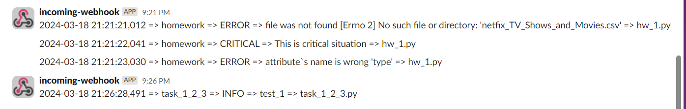

## Netflix IMDB Scores (HomeWork)

* In task_1_2_3.py file you can find solution for those:
  * Create your own logging infrastructure (see the logging_setip.py reference): 2 points 
    * Implemented file and stream loggers
  * Implement custom Handler: 3 points 
    * Used Slack API to receive only errors. 
  * Implementing custom filter: 1 points 
    * Used custom Filter for loggers to receive logs during specific time

 
 
* In hw_1.py you can find solution for:
  * Create a logging config file and figure out how to apply it: 1 point
    * implemented cofig.ini file which consists all loggers (Stream, File and Slack handlers) 
  * Apply this configuration to any of your pet projects: 3 points

  

* config.ini file contains logger handlers for 
    * consoleHandler
    * fileHandler
    * slack_handler

* About project:
  * Took dataset from Keggle:
  https://www.kaggle.com/datasets/thedevastator/netflix-imdb-scores
  * Analysed data according to personal preferences
  * Determine ratio between Movies and TV Shows on netflix platform
  

images of logs on slack
